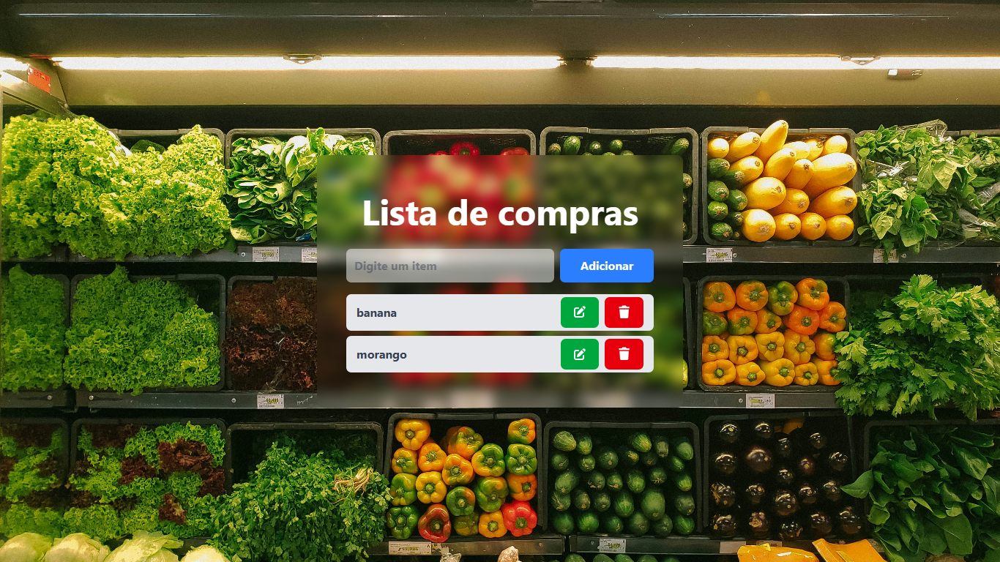

# 🛒 Lista de Compras

Projeto desenvolvido em **React.js** com foco no aprendizado e prática de um **CRUD completo** (Create, Read, Update, Delete).  
A aplicação permite adicionar, listar, editar e excluir itens de uma lista de compras, de forma simples e intuitiva.

---

## 🚀 Funcionalidades

- ➕ **Adicionar** itens à lista  
- 👀 **Visualizar** todos os itens já cadastrados  
- ✏️ **Editar** um item através de um modal personalizado  
- 🗑️ **Remover** itens da lista  

---

## 🛠️ Tecnologias utilizadas

- [React.js](https://react.dev/) – Biblioteca para construção da interface  
- [Tailwind CSS](https://tailwindcss.com/) – Estilização rápida e responsiva  
- [FontAwesome](https://fontawesome.com/) – Ícones para botões de ação  
- **Hooks do React** (`useState`, `useRef`) – Gerenciamento de estado e manipulação de elementos  

---

## 📂 Estrutura do projeto

📦 lista-compras
┣ 📂 src
┃ ┣ 📂 Components
┃ ┃ ┗ 📜 ItemLista.jsx # Componente responsável por exibir, editar e remover itens
┃ ┣ 📜 App.jsx # Componente principal
┃ ┗ 📜 index.css # Estilizações globais (Tailwind)
┣ 📜 package.json
┗ 📜 README.md


## ▶️ Como rodar o projeto

1. **Clone o repositório**
   ```bash
   git clone https://github.com/seu-usuario/lista-compras.git

2. **Acesse a pasta do projeto**
   ```bash
   cd lista-compras
3. **Instale as dependências**
   ```bash
   npm install ou npm i
4. **Execute o projeto**
   ```bash
   npm run dev
4. **Abra o navegador em:**
   https://localhost:5173



📚 Aprendizados

Durante o desenvolvimento, pratiquei:

Gerenciamento de estado com React Hooks

Criação e controle de modais

Uso de componentização para manter o código organizado

Estilização moderna e responsiva com Tailwind CSS

Integração de ícones com FontAwesome

🤝 Contribuições

Fique à vontade para contribuir com melhorias, novas funcionalidades ou sugestões.
Basta abrir uma issue ou enviar um pull request. 🚀